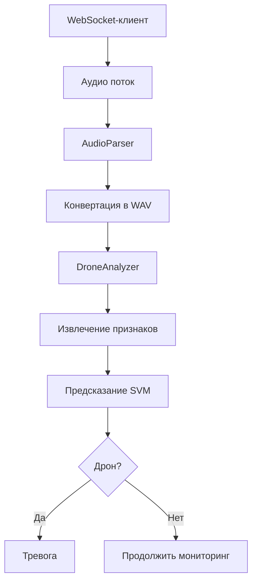

# 🚁 DroneSoundDetector (DSD)

**Анализ аудио потока в реальном времени для детектирования дронов с использованием ML**

## 📌 Оглавление

- [О проекте](#-о-проекте)
- [Ключевые особенности](#-ключевые-особенности)
- [Технологический стек](#-технологический-стек)
- [Установка и запуск](#-установка-и-запуск)
- [WebSocket API](#-websocket-api)
- [ML-модель детектирования](#-ml-модель-детектирования)
- [Разработчикам](#-разработчикам)
- [Лицензия](#-лицензия)

---

## 🌟 О проекте

**Решаемая проблема**:  
Автоматическое обнаружение дронов по звуковому следу без визуального контакта.

**Целевая аудитория**:

- Разработчики систем безопасности
- ML-инженеры
- Энтузиасты компьютерного аудио

**Преимущества**:  
✅ Универсальность решения  
✅ Работа в реальном времени через WebSocket  
✅ Интеграция с геоданными (координаты)

---

## 🚀 Ключевые особенности

- **Аудиоанализ**:
    - Частота дискретизации: 44.1 kHz
    - Поддержка формата: WAV (моно, 16-48 kHz)
- **ML-модель**:
    - SVM с 44 признаками (MFCC + спектральные характеристики)
    - Точность: 93% (на тестовых данных)
- **Система оповещения**:
    - Привязка тревог к координатам
    - Групповые уведомления через WebSocket

---

## 🛠 Технологический стек

| Компонент       | Технологии                    |
|-----------------|-------------------------------|
| Бэкенд          | Django + Django Channels      |
| ML-обработка    | librosa, scikit-learn, joblib |
| Аудио-конвертер | pydub                         |
| Клиентский API  | WebSocket + REST              |
| Деплой          | Docker                        |

---

## ⚙ Установка и запуск

### Локальная установка

```bash
git clone https://github.com/Sgudkov/uavsoundanalysis.git  
cd uavsoundanalysis  
pip install -r requirements.txt  

# Запуск сервера  
python manage.py runserver 0.0.0.0:8000
```

## 🐳 Docker

### Запуск контейнера

```bash
docker pull azrael45/uav:latest
docker run -p 8000:8000 azrael45/uav
```

## 🌐 WebSocket API

### Подключение

```python
import websockets
import json
import base64


async def connect_to_ws():
    async with websockets.connect('ws://your-host/ws/audio') as ws:
        # Чтение аудиофайла
        with open("sample.wav", "rb") as audio_file:
            audio_data = audio_file.read()

        # Отправка данных
        await ws.send(json.dumps({
            "data": base64.b64encode(audio_data).decode('utf-8'),
            "placemarks": [
                {"id": 1, "latitude": 55.751244, "longitude": 37.618423},
                {"id": 2, "latitude": 55.752345, "longitude": 37.619534}
            ]
        }))

        # Получение ответа
        response = await ws.recv()
        print(json.loads(response))
```

### Эндпоинты

| Эндпоинт  | Назначение                    | Формат данных          |
|-----------|-------------------------------|------------------------|
| /ws/      | Основной канал для управления | JSON                   |
| /ws/audio | Передача аудиопотока          | Base64 + JSON metadata |



## 🤖 ML-модель детектирования


### Пример предсказания

```python
analyzer = DroneAnalyzer("drone_sample.wav")
if analyzer.is_drone():
    print("Обнаружен дрон!")
else:
    print("Фоновый шум")
```

## 💻 Разработчикам

### 🛠️ Начало работы

1. **Клонирование репозитория**:
   ```bash
   git clone https://github.com/Sgudkov/uavsoundanalysis.git
   cd uavsoundanalysis
   ```

2. **Установка зависимостей**:
   ```bash
   pip install -r requirements.txt
   ```

3. **Запуск приложения**:
   ```bash
   python manage.py runserver 0.0.0.0:8000
   ```
 
## 📜 Лицензия

### MIT License

```text
Copyright (c) [2025]  

Данная лицензия разрешает лицам, получившим копию данного программного обеспечения 
и сопутствующей документации (в дальнейшем именуемыми "Программное Обеспечение"), 
безвозмездно использовать Программное Обеспечение без ограничений, включая неограниченное 
право на использование, копирование, изменение, слияние, публикацию, распространение, 
сублицензирование и/или продажу копий Программного Обеспечения, а также лицам, которым 
предоставляется данное Программное Обеспечение, при соблюдении следующих условий:

Указанное выше уведомление об авторском праве и данные условия должны быть включены 
во все копии или значительные части Программного Обеспечения.

ПРОГРАММНОЕ ОБЕСПЕЧЕНИЕ ПРЕДОСТАВЛЯЕТСЯ «КАК ЕСТЬ», БЕЗ КАКИХ-ЛИБО ГАРАНТИЙ, ЯВНО 
ВЫРАЖЕННЫХ ИЛИ ПОДРАЗУМЕВАЕМЫХ, ВКЛЮЧАЯ, НО НЕ ОГРАНИЧИВАЯСЬ ГАРАНТИЯМИ ТОВАРНОЙ 
ПРИГОДНОСТИ, СООТВЕТСТВИЯ ПО ЕГО КОНКРЕТНОМУ НАЗНАЧЕНИЮ И ОТСУТСТВИЯ НАРУШЕНИЙ ПРАВ. 
НИ В КАКОМ СЛУЧАЕ АВТОРЫ ИЛИ ПРАВООБЛАДАТЕЛИ НЕ НЕСУТ ОТВЕТСТВЕННОСТИ ПО ИСКАМ О 
ВОЗМЕЩЕНИИ УЩЕРБА, УБЫТКОВ ИЛИ ИНЫХ ТРЕБОВАНИЙ ПО ДЕЙСТВУЮЩЕМУ ПРАВУ, ИЛИ ПО ИНОМУ 
ПОВОДУ, ВОЗНИКШИМ ИЗ-ЗА ИСПОЛЬЗОВАНИЯ ПРОГРАММНОГО ОБЕСПЕЧЕНИЯ ИЛИ ИНЫХ ДЕЙСТВИЙ 
С ПРОГРАММНЫМ ОБЕСПЕЧЕНИЕМ.