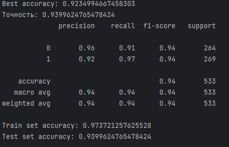
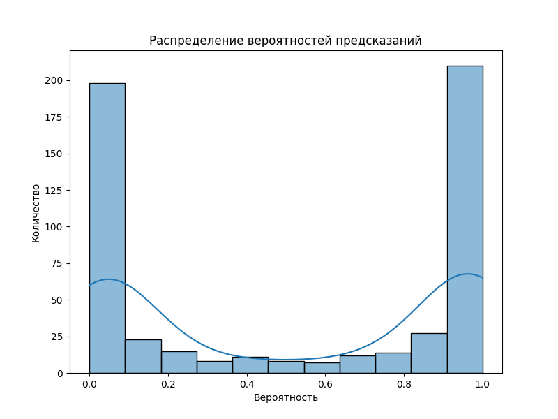

### Архитектура модели

```python
# Инициализация и предсказание
class DroneAnalyzer:
    def __init__(self, file_path: str):
        self.file_path = file_path
        self.features = []

    def is_drone(self) -> bool:
        self.__extract_features()
        return bool(self.__predict())
```

### Извлечение признаков

```python
def __extract_features(self):
    # Загрузка аудио
    audio, sr = librosa.load(self.file_path, sr=44100)

    # MFCC (20 коэффициентов)
    mfccs = librosa.feature.mfcc(y=audio, sr=sr)

    # Спектральные характеристики
    spectral_centroid = librosa.feature.spectral_centroid(y=audio, sr=sr)
    spectral_rolloff = librosa.feature.spectral_rolloff(y=audio, sr=sr)

    # Нормализация
    scaler = StandardScaler()
    normalized_features = scaler.fit_transform(features)
```

### 📊 Метрики производительности

#### Точность классификации
  
```text
Лучшая точность: 0.9235
Точность на тестовом наборе: 0.9400
Точность на обучающем наборе: 0.9737

Отчёт по классам:
| Класс | Precision | Recall | F1-score | Support |
|-------|-----------|--------|----------|---------|
| 0 (Фоновый шум) | 0.96 | 0.91 | 0.94 | 264 |
| 1 (Дрон) | 0.92 | 0.97 | 0.94 | 269 |
```

#### ROC-кривая


ROC-кривая показывает исключительно высокое качество модели:
- AUC (Area Under Curve): 0.99
- Идеальная кривая проходит близко к левому верхнему углу
- Высокий True Positive Rate при низком False Positive Rate

#### Распределение вероятностей


Распределение вероятностей демонстрирует:
- Чёткую бинарную кластеризацию предсказаний
- Большинство предсказаний >0.8 для класса "Дрон"
- Хорошее разделение между классами

### Характеристики модели

| Параметр            | Значение                       |
|---------------------|--------------------------------|
| Алгоритм            | SVM (Support Vector Machine)   |
| Входные признаки    | 44 (20 MFCC + 24 спектральных) |
| Точность (accuracy) | 92-94%                         |
| F1-score            | 0.91-0.93                      |
| Время обработки     | ~120 мс на 2 сек аудио         |

### Формат входных данных

| Параметр     | Требования |
|--------------|------------|
| Формат файла | WAV (PCM)  |
| Частота      | 44.1 kHz   |
| Каналы       | Моно       |
| Длительность | 2-5 секунд |
