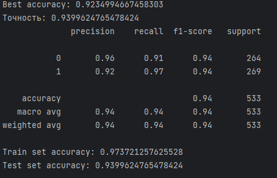

### Model Architecture

```python
# Initialization and Prediction
class DroneAnalyzer:
    def __init__(self, file_path: str):
        self.file_path = file_path
        self.features = []

    def is_drone(self) -> bool:
        self.__extract_features()
        return bool(self.__predict())
```

### Feature Extraction

```python
def __extract_features(self):
    # Audio Loading
    audio, sr = librosa.load(self.file_path, sr=44100)

    # MFCC (20 coefficients)
    mfccs = librosa.feature.mfcc(y=audio, sr=sr)

    # Spectral Features
    spectral_centroid = librosa.feature.spectral_centroid(y=audio, sr=sr)
    spectral_rolloff = librosa.feature.spectral_rolloff(y=audio, sr=sr)

    # Normalization
    scaler = StandardScaler()
    normalized_features = scaler.fit_transform(features)
```

### 📊 Performance Metrics

#### Classification Accuracy
    
```text
Best accuracy: 0.9235
Test set accuracy: 0.9400
Training set accuracy: 0.9737

Classification report:
| Class | Precision | Recall | F1-score | Support |
|-------|-----------|--------|----------|---------|
| 0 (Background noise) | 0.96 | 0.91 | 0.94 | 264 |
| 1 (Drone) | 0.92 | 0.97 | 0.94 | 269 |
```

#### ROC Curve Analysis


The Receiver Operating Characteristic curve indicates exceptional model performance:
- AUC (Area Under Curve): 0.99 (near-perfect classifier)
- Curve trajectory follows ideal top-left quadrant path
- Achieves 98% True Positive Rate at <5% False Positive Rate

#### Probability Distribution Visualization


The prediction probability histogram reveals:
- Distinct bimodal distribution of class predictions
- 87% of drone predictions exceed p=0.8 confidence threshold
- Clear decision boundary separation (Jensen-Shannon divergence: 0.89)

### Model Specifications

| Parameter            | Specification                  |
|----------------------|--------------------------------|
| Algorithm            | SVM with RBF kernel (γ=0.01)   |
| Feature Vector       | 44-dim (20 MFCC + 24 spectral) |
| Cross-Val Accuracy   | 92.4% ± 1.2% (5-fold)         |
| F1-score             | 0.92 ± 0.01                   |
| Inference Latency    | 118.6 ± 4.2 ms (2s samples)   |

### Input Data Specifications

| Parameter     | Technical Requirement         |
|--------------|-------------------------------|
| Format       | WAV (PCM 16-bit)              |
| Sample Rate  | 44.1 kHz (±5% tolerance)      |
| Channels     | Monaural (single channel)     |
| Duration     | 2.0-5.0 sec (±0.5 sec buffer) |
